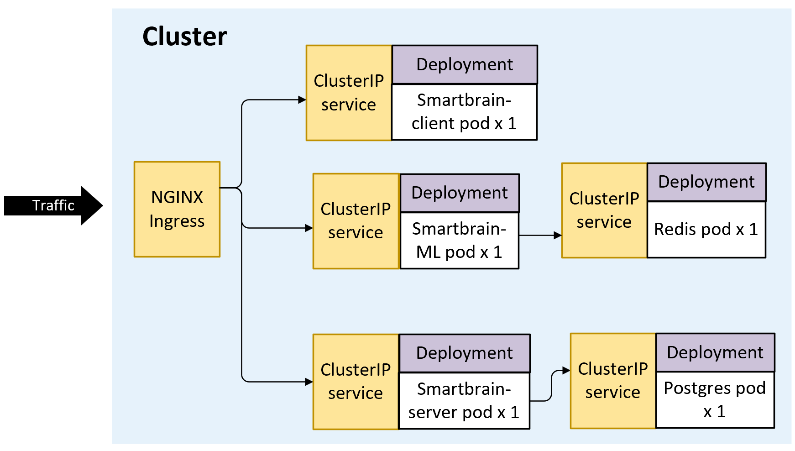
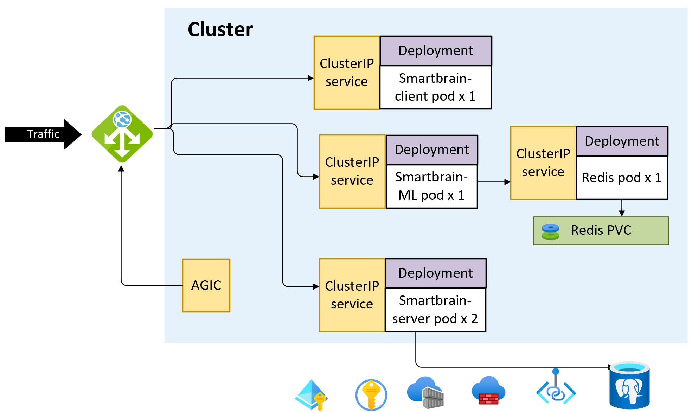

# Enterprise-scale for AKS LevelUp

Repository for the Enterprise Scale for AKS LevelUp training.

1. During this workshop, attendees will be learning about the following topics around containers and AKS.

   1. Microservices
   2. Persistent volume claims and using Managed databases on Azure in your microservice
   3. Private AKS clusters
   4. Docker
   5. Azure policies for AKS
   6. App Gateway Ingress Controller with TLS
   7. CSI driver for Keyvault secret provider
   8. Terraform
   9. .devcontainers

   **Outline of workshop:**

   1. Quick introduction to Enterprise scale for AKS and why we have it
   2. Review the customer scenario and requirements
   3. Quickly Simulate ES for AKS workshop to gather customer requirements and make architectural decisions
   4. Build Enterprise scale for AKS hub, landing zone and supporting services (including ACR and KV) and private cluster using Terraform
   5. Create a Policy so the cluster can only pull images from ACR
   6. Make slight changes to the Node server JavaScript code to accommodate the limitations of AGIC
   7. Build the required images using docker build and push them to ACR
   8. Copy Redis image from Docker hub to ACR
   9. Create Postgres database only accessible via private link using Terraform
   10. Modify the current manifest files as required and create new ones for PVC (for Redis), Secret providers and TLS AGIC
   11. Test the deployment
   12. Wrap up

   **Prerequisites**

   To complete the workshop, you'll need Admin access to an Azure AAD tenant so that you can complete many of the steps. You'll also need Admin & Contributor role to the Azure subscription that you use. If you don't have these higher-level credentials, it'd be best to use your MSDN subscription, if possible. If not, you can still join and watch as the instructor demonstrates the process step-by-step.

   1. You will also need:
   - A level 200 AKS knowledge of AKS

   ​ OR

   - Review the AKS Workshop here: [Azure Kubernetes Service Workshop - Learn | Microsoft Docs](https://docs.microsoft.com/en-us/learn/modules/aks-workshop)

   2. Basic knowledge of [IaC](https://docs.microsoft.com/dotnet/architecture/cloud-native/infrastructure-as-code) (Terraform, ARM or Bicep) is also helpful 
   3. Visual Studio code with Remote Development package installed

   4. Docker desktop or similar installed

   5. Optional: [WSL](https://docs.microsoft.com/en-us/windows/wsl/install)

   You'll be using a Linux terminal for this workshop

   **Customer scenario:**

   During the LevelUp, you'll act as a CSA (Cloud Solution Architect) assigned to help ContosAI International deploy a secure AKS cluster for their workload

   ContosAI is an artificial intelligence (AI) startup  specializing in computer vision. They leverage machine learning and deep neural networks to identify and analyze images and videos. The company offers its solution via API, mobile SDK, and on-premise solutions. To showcase their cutting edge ML models, they are developing a customer facing application whereby customers can sign-up, provide images, and watch ContosAI's face detection model detect the faces in the model. The app is gamified by storing the number of times a user has used the face detector. It ranks the user compared with other users. ContosAI is planning to use the application to showcase their capabilities. They plan to host this new workload on in AKS.

   ConotsoAI has assigned a software developer to create an [MVP](https://en.wikipedia.org/wiki/Minimum_viable_product) (Minimum Viable Product) to evaluate the value of the application and ensure they are headed in the right direction. Being experienced with React and Node JaveScript frameworks, the developer has created a very simple AKS cluster with no security or persistent storage and has deployed the first version of the app into it. He used an NGINX ingress controller because of team's familiarity with it. ContosAI has reached out to you to create a more secure cluster to host the workload.

   The next figure presents a screen shot of the app the developer has created:
   

   Next up is a high-level architectural diagram of the AKS cluster the developer has created:

   

During this workshop, you'll use `Enterprise-Scale for AKS` to create a more secure cluster. The final architecture will closely resemble the following:

:arrow_forward: [Simulate ES for AKS workshop to gather customer requirements and make architectural decisions](./steps/ES-for-AKS.md)
